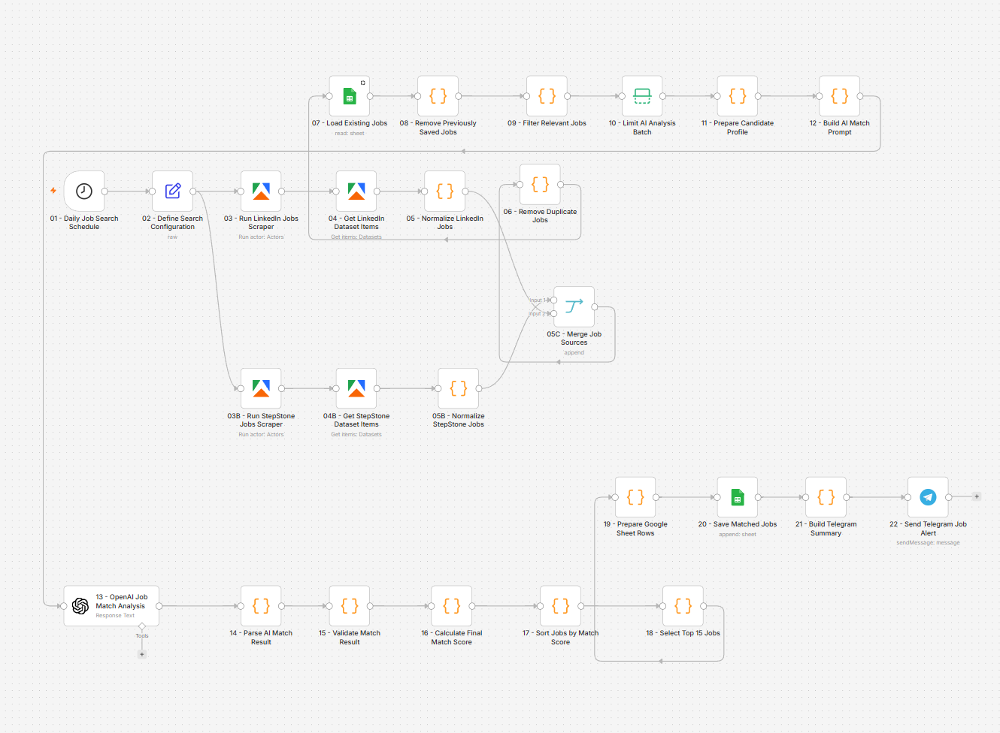

\# AI Job Search \& Candidate Matching Automation

An AI-powered job discovery and candidate-matching workflow built with n8n.

The workflow automatically collects job listings from multiple sources,

normalises and deduplicates the data, removes previously processed jobs,

evaluates relevant positions against a structured candidate profile, and

delivers the best matches through Google Sheets and Telegram.

\## Business Problem

Searching multiple job platforms manually is repetitive and time-consuming.

Job listings may appear more than once, previously reviewed positions can be

processed repeatedly, and evaluating every job against a candidate profile

requires considerable effort.

This workflow centralises job discovery, applies deterministic filtering and

deduplication, and uses an LLM only for semantic candidate-to-job matching.

\## Workflow Features

\- Scheduled daily job discovery

\- LinkedIn job collection through Apify

\- StepStone job collection through Apify

\- Multi-source job merging

\- Standardised job data structure

\- Duplicate job detection

\- Previously saved job exclusion

\- Relevance filtering before AI processing

\- Configurable AI-analysis batch limits

\- Structured candidate profile generation

\- Dynamic AI prompt construction

\- OpenAI-based candidate-to-job analysis

\- AI response parsing and validation

\- Deterministic final-score calculation

\- Match-based sorting and ranking

\- Automatic Top-15 selection

\- Google Sheets result storage

\- Telegram summary and job alerts

\## Technologies

\- n8n

\- OpenAI API

\- Apify

\- JavaScript Code nodes

\- Google Sheets

\- Telegram Bot API

\- REST APIs

\- JSON

\- Prompt Engineering

\- LLM Workflows

\## Workflow Architecture

The workflow deliberately separates deterministic processing from AI analysis.

Deterministic logic handles:

\- data normalisation

\- deduplication

\- previously saved job detection

\- relevance filtering

\- score validation

\- preference adjustments

\- sorting

\- Top-N selection

AI is used for:

\- semantic role matching

\- technical-skills comparison

\- experience evaluation

\- identification of matching and missing skills

\- recommendation generation

\- concise job-fit explanation

This design reduces unnecessary AI usage, improves consistency and makes the

workflow easier to test and maintain.

\## Workflow Process

1\. The daily schedule starts the workflow.

2\. Search terms and configuration values are prepared.

3\. LinkedIn and StepStone Apify actors are executed.

4\. Dataset items are retrieved from both sources.

5\. Job records are normalised into a shared schema.

6\. Results from all job sources are merged.

7\. Duplicate jobs are removed.

8\. Existing jobs are loaded from Google Sheets.

9\. Previously saved jobs are excluded.

10\. Irrelevant jobs are filtered before AI analysis.

11\. The configurable AI-analysis limit is applied.

12\. A structured candidate profile is prepared.

13\. A job-specific AI matching prompt is generated.

14\. OpenAI evaluates each job against the candidate profile.

15\. The AI response is parsed and validated.

16\. Deterministic preference adjustments are applied.

17\. Jobs are sorted by final match score.

18\. The best 15 jobs are selected.

19\. Google Sheets rows are prepared and saved.

20\. A Telegram summary is generated and delivered.

\## Match Evaluation

The AI analysis evaluates areas such as:

| Category | Description |

|---|---|

| Technical match | Alignment between required and available technologies |

| Role match | Relevance of the job title and responsibilities |

| Experience match | Compatibility with professional experience |

| Language match | Required and available language levels |

| Location match | Remote, hybrid, local or relocation compatibility |

| Employment match | Full-time, part-time or freelance compatibility |

The validated result may include:

\- Match score

\- Recommendation

\- Application priority

\- Matching skills

\- Missing skills

\- Short fit summary

\- Direct application URL

\## Required Configuration

Before activating the workflow, configure:

\- Apify credentials

\- LinkedIn Jobs Scraper actor

\- StepStone Jobs Scraper actor

\- OpenAI credentials

\- Google Sheets credentials

\- Telegram credentials

\- Google Sheet ID

\- Telegram Chat ID

\- Search keywords

\- Search locations

\- Minimum match score

\- Maximum AI-analysis batch size

\- Number of final jobs

\## Google Sheets Output

Recommended columns:

| Column | Description |

|---|---|

| jobKey | Unique source and job identifier |

| foundAt | Date the job was discovered |

| source | LinkedIn, StepStone or another source |

| title | Job title |

| company | Employer |

| location | Job location |

| postedAt | Publication date |

| employmentType | Employment arrangement |

| seniorityLevel | Expected seniority |

| salary | Salary information when available |

| matchScore | Final validated match score |

| recommendation | AI-generated recommendation |

| applicationPriority | HIGH, MEDIUM or LOW |

| matchingSkills | Candidate skills matching the job |

| missingSkills | Important skills not found in the profile |

| summary | Concise job-fit explanation |

| jobUrl | Original listing URL |

| applicationUrl | Direct application URL |

| searchTerm | Search keyword that found the job |

\## Security

The public workflow must not contain:

\- API keys

\- access tokens

\- Telegram bot tokens

\- Telegram Chat IDs

\- Google Sheet IDs

\- private candidate information

\- credential IDs

\- private Apify dataset IDs

Credentials must be configured directly inside n8n after importing the

workflow.

## Workflow Overview

\## Import

1\. Download `workflow.json`.

2\. Import the file into n8n.

3\. Configure Apify credentials.

4\. Configure OpenAI credentials.

5\. Configure Google Sheets credentials.

6\. Configure Telegram credentials.

7\. Replace all placeholder configuration values.

8\. verify the Google Sheets column structure.

9\. Execute the workflow manually.

10\. Review the AI result and score validation.

11\. Activate the daily schedule.

\## Portfolio Value

This project demonstrates:

\- end-to-end workflow architecture

\- multi-source data integration

\- AI and deterministic logic separation

\- prompt engineering

\- structured LLM output processing

\- validation and scoring

\- API integration

\- cost-aware AI processing

\- business-process automation

\- automated reporting and notifications

\## Possible Improvements

\- Add Indeed and XING job sources

\- Add configurable candidate profiles

\- Add CV-specific matching

\- Generate application drafts automatically

\- Track application status

\- Add follow-up reminders

\- Add Slack or email delivery

\- Add workflow-level error notifications

\- Add execution analytics and cost reporting

